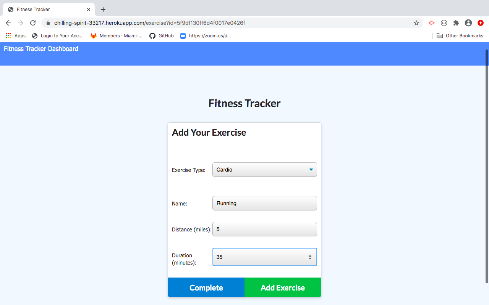
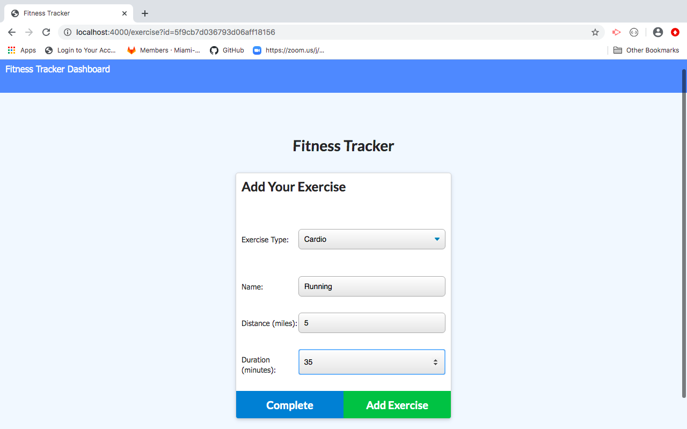
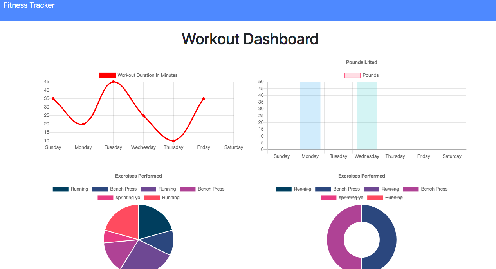

# fitness_tracker

This application is a simple workout tracker.  The user can view, create, and track their daily workouts.  The user can manually log multiple exercises at a time and the exercises are categorized as cardio or resistance.  For cardio, the user can track their distance in miles and the duration of the exercise.  For resistance, the user can track how much weight they are lifting, the amount of sets, the amount of reps within each set, and the duration of the exercise.  This application uses MongoDB, mongoose, express, and node.

Deployed: 

### Image of Previously Added Workout

### Image of Newly Added Workout

### Image of Workout Stats
