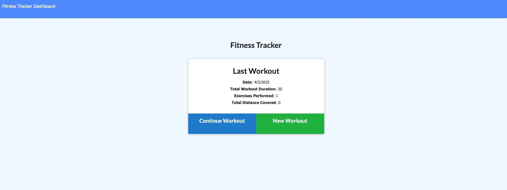

# Workout Tracker Application

The Workout Tracker is a web application designed to help users log and track their daily workouts. With this app, users can add exercises into two main categories: Cardio and Resistance. For Cardio exercises, users can track their distance (in miles) and duration. For Resistance exercises, users can log the weight lifted, the number of sets, the number of reps per set, and the duration.

The application is built using Node.js, Express, and MongoDB with Mongoose for database management. It offers a user-friendly interface to manually input workout data and monitor progress over time

## Features

* Track Daily Workouts: Add, view, and edit daily workouts.
* Cardio Exercises: Log cardio exercises with distance (in miles) and duration.
* Resistance Exercises: Log resistance exercises with weight lifted, sets, reps per set, and duration.
* Exercise Categories: Separate tracking for Cardio and Resistance exercises for better organization.
* Database Management: All workout data is stored in a MongoDB database using Mongoose.
* REST API: The app exposes RESTful endpoints to manage and fetch workout data.

## Technologies Used:

* Frontend:
    * HTML5
    * CSS3
    * JavaScript
* Backend:
    * Node.js
    * Express
    * MongoDB (Database)
    * Mongoose (MongoDB ODM)

### Prerequisites

* Node.js and npm installed on your machine.
* MongoDB (either locally or using a cloud service like MongoDB Atlas)

### Installation

1. Clone the repository: 
    git clone https://github.com/caseofbase18/fitness_tracker.git
2. Navigate into the project directory: 
    cd fitness_tracker
3. Install dependencies: 
    npm install

## Usage

To start the app locally:
    npm run start

This will start the development server on http://localhost:4000

Adding a Cardio Workout:
* Name: Enter the name of your cardio workout ie. Run.
* Distance: Enter the distance covered in miles.
* Duration: Enter the time in minutes spent performing the cardio exercise.

Adding a Resistance Workout:
* Name: Enter the name of your resistance workout ie. Bench Press.
* Weight: Enter the weight lifted (in pounds).
* Sets: Specify the number of sets.
* Reps per Set: Enter the number of repetitions per set.
* Duration: Log the duration in minutes of the exercise.

## Screenshots

### Home Page

### Adding New Workout

### Dashboard
